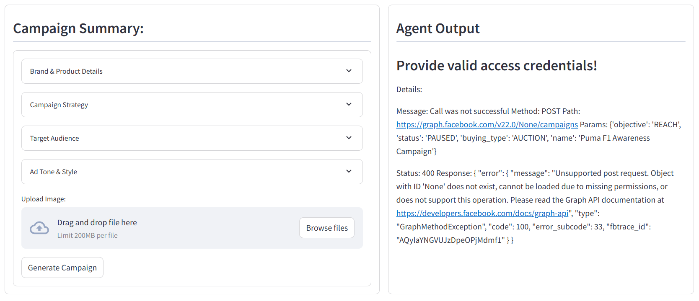

# 🧠 Campaign Generator Agent

This project is a **Streamlit-based application** that uses **LangChain**, **Google Gemini**, and the **Meta (Facebook/Instagram) Marketing API** to automatically generate and launch end-to-end Meta ad campaigns. With a few simple inputs like brand details, campaign goals, and audience targeting, the app creates optimized ads including creatives, ad sets, and final ad deployments — optionally generating ad images using AI.

---

## 🚀 Features

* **Interactive UI:** Built with Streamlit for seamless user experience.
* **AI-Powered Content Generation:** Uses Google Gemini (via LangChain) to generate ad copy and images.
* **Meta Ads Integration:** Automates campaign, ad set, creative, and ad creation using Meta's Marketing API.
* **Tool Chaining with LangGraph:** Dynamically routes tasks to the appropriate agent/tool based on user prompt.
* **Image Handling:** Supports both user-uploaded images and AI-generated images from prompts.
* **Ad Styling:** Lets users specify tone, image style, and campaign objectives.

---

## 🧩 Architecture Overview

```
User Input (Streamlit UI)
         ↓
 Prompt Generator (LLM)
         ↓
LangGraph Orchestration → Tool Calls (Campaign, AdSet, Creative, Image, Ad)
         ↓
Meta Marketing API → Ad Campaign Live!
```

---

## 🛠️ Tech Stack

| Component      | Technology                                |                  
| -------------- | ----------------------------------------- |
| Frontend       | Streamlit                                 |
| Backend LLM    | Google Gemini via LangChain               |
| Agent Routing  | LangGraph                                 |
| Tools          | LangChain Tooling, Facebook Business SDK  |
| Image Upload   | Local Image/AI Generated (Base64 decoded) |
| Knowledge Tool | Tavily Search                             |

---

## 📦 Installation

1. **Clone the repo:**

   ```bash
   git clone https://github.com/a2hishek/AdCampaigAgent.git
   cd meta-ai-ad-campaign-generator
   ```

2. **Create virtual environment and activate it:**

   ```bash
   python -m venv venv
   venv\Scripts\activate
   ```

3. **Install dependencies:**

   ```bash
   pip install -r requirements.txt
   ```

4. **Create a `.env` file** and add your API credentials:

   ```ini
   GOOGLE_API_KEY=your_google_api_key
   TAVILY_API_KEY=your_tavily_api_key
   META_ACCESS_TOKEN=your_facebook_access_token
   META_APP_ID=your_facebook_app_id
   META_APP_SECRET=your_facebook_app_secret
   META_AD_ACCOUNT_ID=act_xxxxxxxxxxxxxxx
   ```

5. **Run the app:**

   ```bash
   streamlit run app.py
   ```

---

## 🧪 Usage Instructions

1. Fill out the **Brand & Product Details**, **Campaign Strategy**, and **Target Audience**.
2. Choose to **upload your own image** or describe an **image style** for the AI to generate.
3. Click **Generate Campaign** — the AI handles the rest!
4. View detailed **agent output** including campaign IDs and results.

---

## 📁 Folder Structure

```
.
├── app.py                 # Main Streamlit app
├── graph.py               # LangGraph pipeline and tool chaining
├── tools.py               # Tools for Meta Ads API calls
├── graph_utilities.py     # Shared state, routing logic, and message handling
├── prompt.py              # Campaign prompt builder
├── Images/                # Image upload and generation storage
├── .env                   # Environment secrets
└── requirements.txt       # Python dependencies
```


## Output Example


- Based on recieved input and prompt instructions the llm generates the first tool call for adCamapignGenerator tool with valid arguments parsed from user input like Objective and Name.
- The tool is invoked by the tool node with the llm generated arguments and the post request is sent to the api with valid arguments.
- The api request fails due to absence of the access tokens and other user credentials.
- Conclusion: The llm is calling the correct tools with valid arguments and correct schema to generate a campaign. 

---

## ✅ TODO (Future Enhancements)

- Improve the graph structure to make tool calling and argument passing more robust.
- Create a more informed user input section after testing the full campaign generation flow.
- Prompt enhancements to create a more robust automation workflow.
- Add support for other ad platforms like google.
- Current graph structure:
  


---
